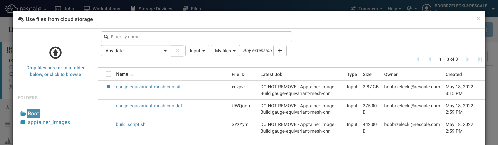
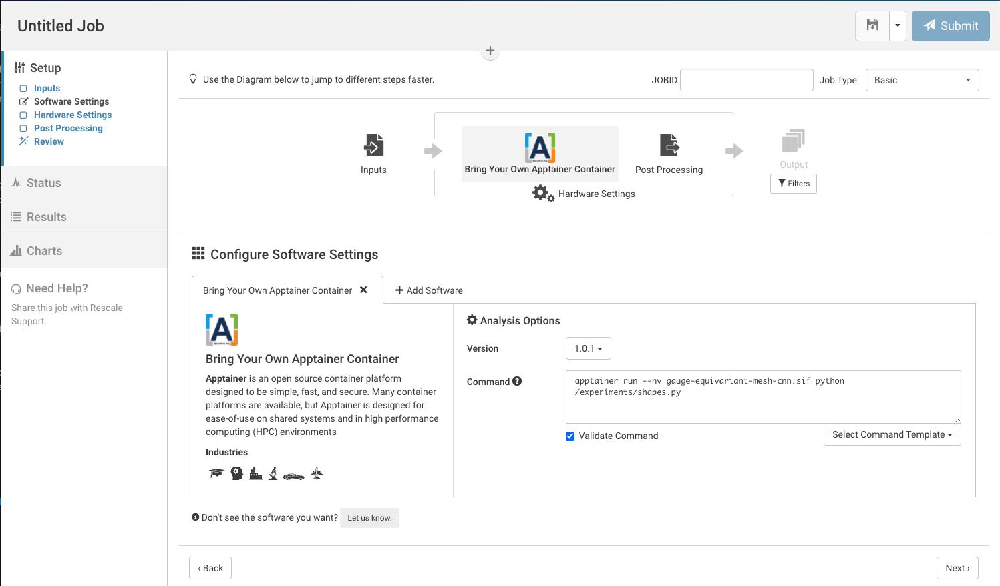
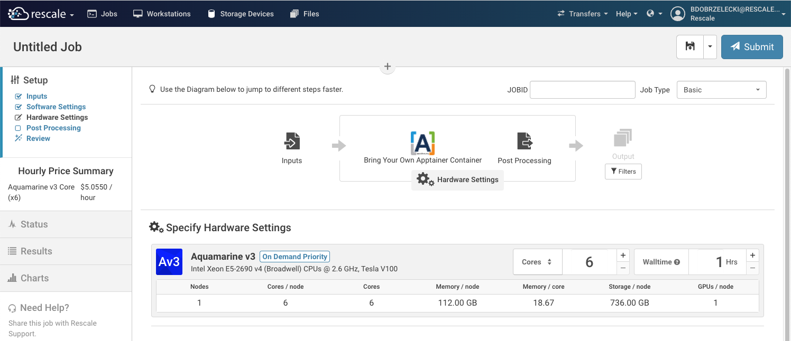
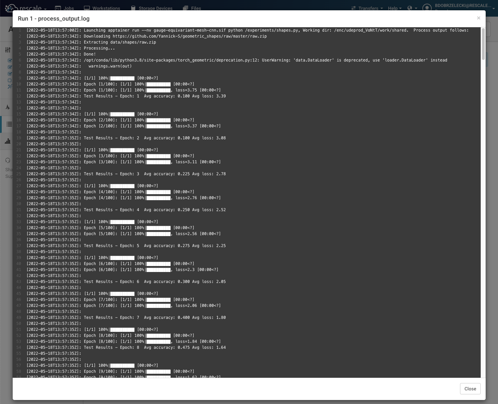

# README

This document demonstrates how to work with Apptainer containers on Rescale. It uses an opensource, docker-based implementation of a GPU backed CNN available at https://github.com/Qualcomm-AI-research/gauge-equivariant-mesh-cnn

## First things first

Before attempting to port third-party containers to Apptainer and Rescale, always make sure that the original `Dockerfile` produces a usable image. In the case of the “Geometric Mesh CNN”—the original code produced an image that was throwing runtime exceptions. Appendix 1 discusses the encountered runtime problem and a solution applied before proceeding with the Docker->Apptainer image conversion.

## Converting Dockerfile to Apptainer def file

Conversion notes assume fixed dockerfile listed below (also see [gauge-equivariant-mesh-cnn.Dockerfile](gauge-equivariant-mesh-cnn.Dockerfile)).

```
FROM pytorch/pytorch:1.11.0-cuda11.3-cudnn8-runtime
RUN apt-get update && \
    apt-get install -y --no-install-recommends build-essential cmake && \
    rm -rf /var/lib/apt/lists/*
ADD . /workspace
RUN pip install -f https://data.pyg.org/whl/torch-1.11.0+cu113.html -e .
```

This is admittedly a relatively simple `Dockerfile` but it is also quite common for pytorch applications, where most of the logic in is user created Python files.

The equivalent Apptainer Definition file is in [gauge-equivariant-mesh-cnn.def](gauge-equivariant-mesh-cnn.def) and listed below.

```
Bootstrap: docker
From: pytorch/pytorch:1.11.0-cuda11.3-cudnn8-runtime

%files
  .

%post
  apt-get update
  apt-get install -y --no-install-recommends build-essential cmake
  rm -rf /var/lib/apt/lists/*
  pip install -f https://data.pyg.org/whl/torch-1.11.0+cu113.html -e .
```

Apptainer supports several bootstrapping mechanisms. Here we point to an image stored on DockerHub (`FROM` clause from `Dockerfile`).

The `%files` section copies files into container. This is equivalent to the `ADD` command. Dot (`.`) means that all files from the directory in which `apptainer build` command is invoked, will be copied to image's working directory (which is the root `/` directory). In the `Dockerfile` case - files are copied to `/workspace` because the base container defines a working directory through the `WORKDIR` Docker command [see here](https://hub.docker.com/layers/pytorch/pytorch/pytorch/1.11.0-cuda11.3-cudnn8-runtime/images/sha256-9904a7e081eaca29e3ee46afac87f2879676dd3bf7b5e9b8450454d84e074ef0?context=explore). Apptainer ignores this setting (it is possible to define working directory at runtime by passing `--workdir` option to the apptainer executable).

Mapping of `RUN` commands to the `%post` section is self explanatory.

Direct 1:1 porting between Dockerfile and Apptainer Definition file is a recommended path. It helps the user understand which external dependencies are used to build the container, and the result is a “vanilla” Apptainer image (SIF).

For more tips on converting Dockerfiles to Apptainer Definition files, see
[here](https://apptainer.org/docs/user/main/docker_and_oci.html#apptainer-definition-file-vs-dockerfile).

## Building and storing Apptainer images (SIF files) on Rescale

One of the options is to build the SIF image locally and upload it to Rescale.

Another option is to build the image as a Rescale job. The advantage of building on Rescale is that we are using the same Apptainer version as we will use for running the container. Additionally, our resulting SIF image is stored on Rescale cloud without the need for file upload. We also do not need to set up an Apptainer build environment locally—this way we can build Apptainer images even if our desktop is Windows-based.

The `image_builder/` directory includes a Python script using the Rescale API to submit an image build job. Readers are encouraged to inspect the script to understand how automation can look like on Rescale. To invoke the script, follow the steps below (provide your apikey):

```
$ cd image_builder/
$ pip install -r requirements.txt
$ python build_image.py \
  --apikey {{your-api-key}} \
  --deffile ../gauge-equivariant-mesh-cnn.def \
  --buildscript ../build_script.sh \
  --jobname "DO NOT REMOVE - Apptainer Image Build gauge-equivariant-mesh-cnn"
```

The `build_scriipt.sh` file contains the build script that will be executed as a job command. It clones the `gauge-equivariant-mesh-cnn` repository, copies `deffile` into it and executes `apptainer build` command. Both `deffile` and `buildscript` are uploaded to Rescale by the script. All files except the `gauge-equivariant-mesh-cnn.sif` are then removed to limit the file that are staged off the cluster into cloud storage.

Note that in order for the SIF image file to be usable by other jobs—we need to keep the build job and not archive it. It is recommended to add `DO NOT REMOVE` to the job name, so it gives a clear signal that other jobs may depend on files produced by the build job.

## Launching an Apptainer backed job on Rescale

The SIF image file created during the build step is tagged as an input file. When defining inputs for a new job, select “Add from cloud storage” and select the SIF image.



Select "Bring Your Own Apptainer Container" tile as your software. For this example, use the following command:

```
apptainer run --nv gauge-equivariant-mesh-cnn.sif python /experiments/shapes.py
```

Note the `/` before `/experiments` - this is needed because during the build phase we have copied repository contents to root directory of a container image. Apptainer by default overlays on top of host filesystem - so the current working directory will be a working directory in a container.



Select GPU Enabled coretype and Submit!



Observe results.



## Converting Docker container image to Apptainer (SIF) image

TODO.

## Appendices

### [1] Breaking tensorflow API changes

The original `Dockerfile` builds, but when examples are run, a runtime exception is thrown indicating a breaking change in pytorch.

```
[centos@ip-172-31-25-69 gauge-equivariant-mesh-cnn]$ docker run -it --rm 3fcc024b1c54 python experiments/faust_direct.py
Traceback (most recent call last):
  File "experiments/faust_direct.py", line 8, in <module>
    import torch_geometric.transforms as T
  File "/opt/conda/lib/python3.7/site-packages/torch_geometric/__init__.py", line 4, in <module>
    import torch_geometric.data
  File "/opt/conda/lib/python3.7/site-packages/torch_geometric/data/__init__.py", line 1, in <module>
    from .data import Data
  File "/opt/conda/lib/python3.7/site-packages/torch_geometric/data/data.py", line 9, in <module>
    from torch_sparse import SparseTensor
  File "/opt/conda/lib/python3.7/site-packages/torch_sparse/__init__.py", line 41, in <module>
    from .tensor import SparseTensor  # noqa
  File "/opt/conda/lib/python3.7/site-packages/torch_sparse/tensor.py", line 13, in <module>
    class SparseTensor(object):
  File "/opt/conda/lib/python3.7/site-packages/torch/jit/_script.py", line 1128, in script
    _compile_and_register_class(obj, _rcb, qualified_name)
  File "/opt/conda/lib/python3.7/site-packages/torch/jit/_script.py", line 138, in _compile_and_register_class
    script_class = torch._C._jit_script_class_compile(qualified_name, ast, defaults, rcb)
RuntimeError: 
object has no attribute sparse_csr_tensor:
  File "/opt/conda/lib/python3.7/site-packages/torch_sparse/tensor.py", line 511
            value = torch.ones(self.nnz(), dtype=dtype, device=self.device())
    
        return torch.sparse_csr_tensor(rowptr, col, value, self.sizes())
               ~~~~~~~~~~~~~~~~~~~~~~~ <--- HERE
```

This was fixed by updating the `Dockerfile` to use the latest pytorch/cuda combination (tag: `1.11.0-cuda11.3-cudnn8-runtime`). To check the latest available pytorch containers see https://hub.docker.com/r/pytorch/pytorch/tags

To find matching CUDA Toolkit installers (if needed) https://developer.nvidia.com/cuda-11.3.0-download-archive


